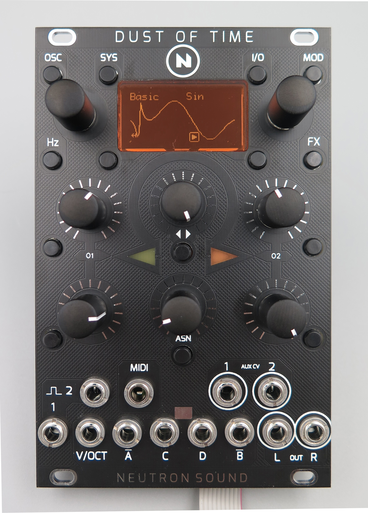

# Neutron sound Dust of time public files
These are public files for the Neutron sound Dust of time, the board files and firmware are currently not open source. 

Dual Eurorack stereo oscillator with modulators, utilities, MIDI and gate processing/generating.

Early manual:
https://docs.google.com/document/d/1-gQu5ynSra2hIat8SPNhFe4P0LNxqjS46jEjF0CGYL4/edit#

iBom:
http://neutron-sound.com/Dust_of_Time/iBOM/DoT_DIY_1.html

Sheets BOM.
https://docs.google.com/spreadsheets/d/17djLz1EoS_psm07unBG9bsfwifHIKXat84gAcTS3g00/edit#gid=100086201

